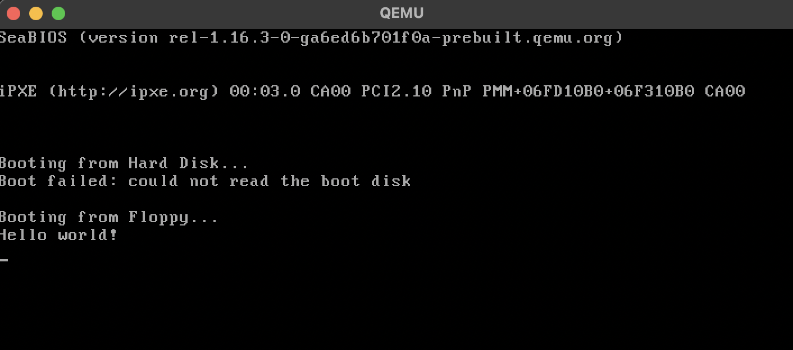

## 🖥️ Introduction 
We have updated our bootloader and kernel setup by separating them into distinct components and modifying the Makefile to handle this structure. 

---
## 📝 What is FAT12?

FAT12 (File Allocation Table 12-bit) is one of the earliest filesystem formats used in floppy disks and early hard drives. It is characterized by:

- 12-bit File Allocation Table (FAT) for tracking file clusters.
- A boot sector that contains information about the filesystem.
- Root directory with a fixed size (for floppy disks).
- Data section where files are stored in clusters.

FAT12 is widely used in legacy systems and is ideal for bootloaders because BIOS supports reading from it natively.

## FAT12 Boot Sector 💪
Reference here : [OS Wiki](https://wiki.osdev.org/FAT#FAT_12)
The first 512 bytes of a FAT12 disk must include a BIOS Parameter Block (BPB), which describes the disk format.
The BIOS loads this first sector into memory at 0x7C00 and jumps to it.
```
bdb_oem:                    db 'MSWIN4.1'      ; 8-byte OEM name
bdb_bytes_per_sector:       dw 512
bdb_sector_per_cluster:     db 1
bdb_reserved_sector:        dw 1
bdb_fat_count:              db 2
bdb_dir_entries_count:      dw 0E0h
bdb_total_sectors:          dw 2880            ; 1.44MB floppy
bdb_media_descriptor_type:  db 0F0h            ; 3.5" floppy
bdb_sectors_per_fat:        dw 9
bdb_sectors_per_track:      dw 18
bdb_heads:                  dw 2
```
These values describe how the disk is structured, allowing the bootloader to locate and load stuff

## 📌 Bootloader & Kernel
Now we moved bootloader and kernel into separate directories for more modularity.
```
src
├── bootloader
│   └── boot.asm
├── kernel
│   └── kernel.c
└── ...
```
### Bootloader
The boot.asm file is a bootloader written in 16-bit assembly for a FAT12-formatted floppy disk. Below is a breakdown of its structure and purpose:

The bootloader's job is to:
- Load itself into memory at 0x7C00 (BIOS loads the first sector here).
- Set up basic CPU registers, segments, and stack.
- Read the kernel from the second sector of the floppy disk into memory.
- Execute the kernel.

### 🗓 Disk Reading (LBA → CHS Conversion & BIOS INT 13h)
To load the kernel, we must read from the floppy disk using BIOS interrupts.

Convert LBA (Logical Block Addressing) to CHS (Cylinder-Head-Sector)
FAT12 uses CHS addressing, so we convert LBA addresses first.

```nasm
lba_to_chs:
	
	push ax
	push dx

	xor dx, dx								; dx = 0
	div word [bdb_sectors_per_track]		; ax = LBA / sectors_per_track
											; dx = LBA % sectors_per_track
	inc dx									; dx = (LBA % sectors_per_track + 1) = sector
	mov cx, dx								; cx = sector

	xor dx, dx								; dx = 0
	div word [bdb_heads]					; ax = (LBA / sectors_per_track) / heads = cylinder
											; dx = (LBA / sectors_per_track) % heads = head
	; dl is lower 8 bit of dx
	mov dh, dl								; dh = head
	mov ch, al								; ch = cylinder (lower 8 bits)
	shl al, 6
	or cl, ah								; upper 2 bits of cylinder to CL

	pop ax
	mov dl, al								; restore dl
	pop ax

	ret
```

Read Data Using BIOS INT 13h
```nasm
disk_read:
	push ax									; save registers that will be used
	push bx
	push cx
	push dx
	push di

	push cx 								; temporarily save cx (number of sectors to read)
	call lba_to_chs							; compute our CHS address
	pop ax									; al = number of sectors to read

	mov ah, 02h								;
	mov di, 3								; since floppy disk might be unreliable, retry 3x
	int 13h									; call interrupt 13h

.retry:
	pusha									; save all register, dont know which BIOS used
	stc 									; set carry flag, some BIOS dont set it
	int 13h									; if carry flag cleared -> success
	jnc .done								; jump if carry not set (cleared)

	; read failed
	popa
	call disk_reset

	dec di									; retry until di = 0 
	test di, di
	jnz .retry

.fail:
	; all attempts exhausted, still fail
	; jump to error message
	jmp floppy_error

.done:
	popa

	pop di
	pop dx
	pop cx
	pop bx
	pop ax									; restore modified registers
	ret
```
This function calls BIOS INT 13h to read sectors from the disk. In case of failures, it implements 3 retries.
disk_reset is called if all attempts fail.
```
;
;	Reset disk controller
;	Parameters:
;		- dl: drive number
;
disk_reset:
	pusha
	mov ah, 0								; reset disk
	stc
	int 13h
	jc floppy_error
	popa
	ret
```

```
;
; Error handlers
;
floppy_error:
	mov si, msg_read_failed
	call puts
	jmp wait_and_key_reboot

wait_and_key_reboot:
	mov ah, 0
	int 16h						; wait for keypress
	jmp 0FFFFh:0				; jump to beginning of BIOS, should reboot
	hlt
```

### 📖 Kernel
We have not changed anything from main.asm previously :D

## 🛠️ Build & Run  
```
make
./run.sh
```

## 🖥 Result
Hello world! still printed :D<br>


