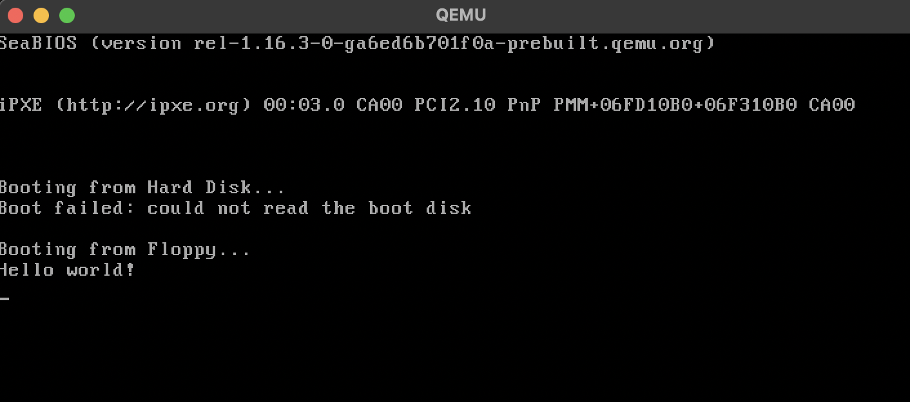

# 🖥️ Hello World!
In this section, I am writing a Simple Bootloader with NASM and QEMU thats simply prints "Hello World!".
<!--    -->

---

## 🌟 Setting up
Directory Structure :
```
os-dev/
├── src/
│   ├── main.asm  # Our bootloader
├── build/        # Stores the compiled binaries later
├── Makefile
```

## 🔧 Writing Makefile  
This Makefile compiles main.asm into a raw binary and prepares a floppy disk image for QEMU.

```
ASM=nasm

SRC_DIR=src
BUILD_DIR=build

$(BUILD_DIR)/main_floppy.img: $(BUILD_DIR)/main.bin
	cp $(BUILD_DIR)/main.bin $(BUILD_DIR)/main_floppy.img
	truncate -s 1440k $(BUILD_DIR)/main_floppy.img

$(BUILD_DIR)/main.bin: $(SRC_DIR)/main.asm
	$(ASM) $(SRC_DIR)/main.asm -f bin -o $(BUILD_DIR)/main.bin
```

## 🚀 Writing the Bootloader (main.asm) 
- **`org 0x7C00`** → BIOS loads boot sector here
- **`puts` function** → Prints characters using BIOS interrupts
- **`msg_hello`** → Stores the "Hello world!" string
- **Padding with `times 510-($-$$) db 0`** → Ensures the boot sector is exactly 512 bytes
```
org 0x7C00
bits 16

; macro for endl hex
%define ENDL 0x0D, 0x0A

start: ; so main is still entry point
	jmp main 

; we want to print a string
; Params : ds:si points to a string

puts:
	; save registers that is modified later
	push si
	push ax

.loop:
	; lodsb loads result in al
	lodsb	        ; load a byte from ds:si and increment the si by 1 byte	to AL
	or al, al	    ; verify if null or not (if 0, zero-flag next -> null terminating char)
	jz .done        ; jump if zero flag set

	; prints a character stored by al	
	mov ah, 0x0e    ; interrupt number
	mov bh, 0       ; set page number 0 since not graphic
	int 0x10        ; for video interrups (here for only printing char in tty)

	jmp .loop
	
.done:
	pop ax
	pop si
	ret

main:

	; setup data segments
	mov ax, 0
	; cant directly write a const to ds/es
	mov ds, ax
	mov es, ax

	; setup stack
	mov ss, ax
	mov sp, 0x7C00	; stack grows downward from here

	; print message
	mov si, msg_hello
	call puts

	hlt

.halt:
	jmp .halt

msg_hello: db "Hello world!", ENDL, 0

times 510-($-$$) db 0
dw 0AA55h
```

## 🛠️ Build & Run  
```
make
qemu-system-i386 -fda build/main_floppy.img
```

## 🖥 Result
Hello world! printed :D<br>


